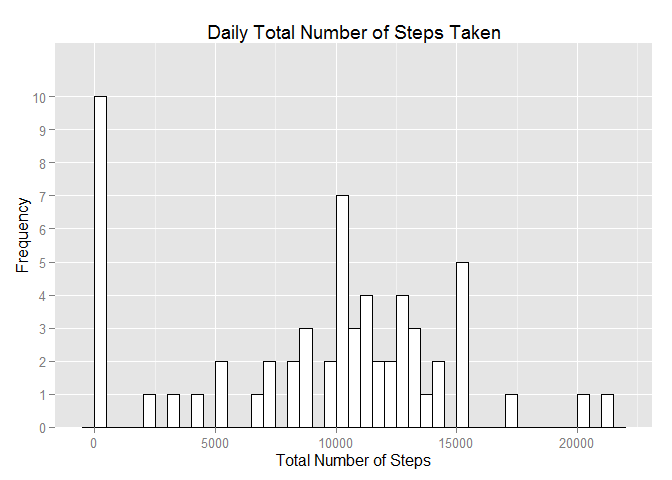
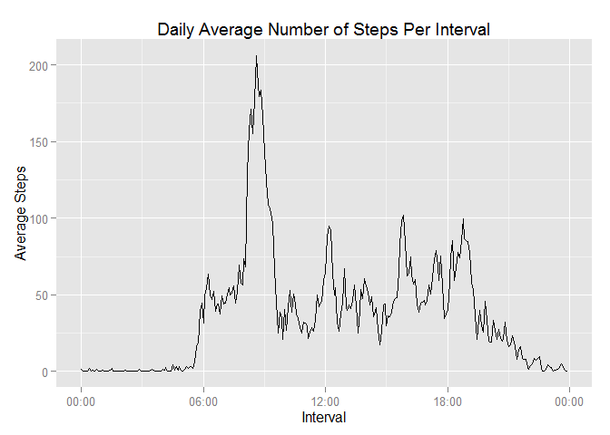
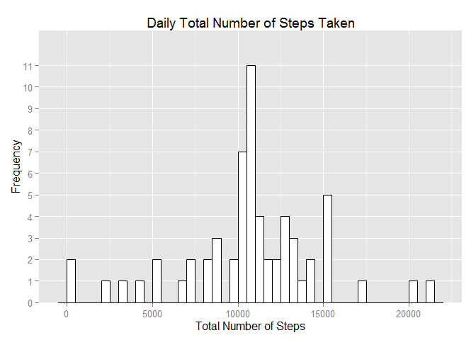
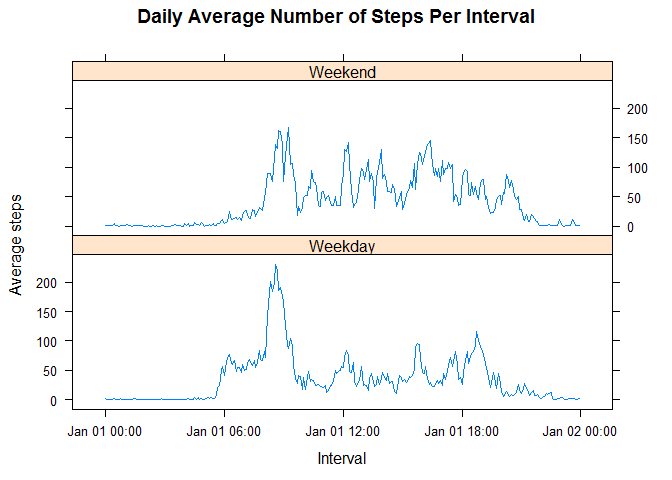
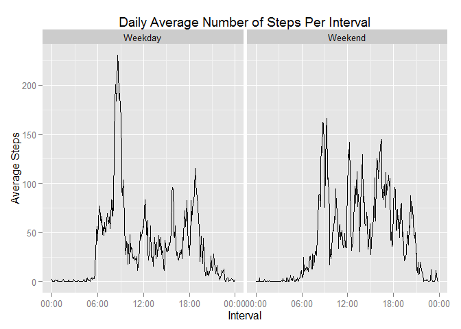

# Reproducible Research: Peer Assessment 1


### Loading and preprocessing the data

<!-- 1. Load the data (i.e. read.csv()) -->


```r
if (!file.exists('activity.csv')) {
        unzip(zipfile = 'activity.zip')
}

activity.data <- read.csv('activity.csv')
```

<!-- 2. Process/transform the data (if necessary) into a format suitable for your analysis -->

Create a timestamp column that contains a POSIXct representation of the contents of the date and interval columns.


```r
activity.data <- within (activity.data, {timestamp = format(as.POSIXct(paste(date, gsub("([0-9]{1,2})([0-9]{2})", "\\1:\\2", formatC(interval, width=3, format="d", flag="0"))), "%Y-%m-%d %H:%M", tz = "UTC"))})
activity.data$timestamp <- as.POSIXct(activity.data$timestamp)
```

Create a time column that contains a 24 hour representation of the measurement interval.


```r
activity.data <- within (activity.data, {time = format(as.POSIXct(paste("2000-01-01", gsub("([0-9]{1,2})([0-9]{2})", "\\1:\\2", formatC(interval, width=3, format="d", flag="0"))), "%Y-%m-%d %H:%M", tz = "UTC"))})
activity.data$time <- as.POSIXct(activity.data$time)
```

### What is mean total number of steps taken per day?

<!-- 1. Make a histogram of the total number of steps taken each day -->


```r
daily.steps <- aggregate(steps ~ date, activity.data, sum, na.rm=TRUE, na.action=NULL)

ggplot(data = daily.steps, aes(x=daily.steps$steps)) +
       geom_histogram(binwidth=500,
                      fill="white",
                      colour="black") +
       ggtitle("Daily Total Number of Steps Taken") +
       xlab("Total Number of Steps") +
       ylab("Frequency") +
       scale_y_discrete()
```

 

<!-- 2. Calculate and report the mean and median total number of steps taken per day -->


```r
mean.steps <- mean(daily.steps$steps)
median.steps <- median(daily.steps$steps)
```

* The **mean** total number of steps taken per day is 9354
* The **median** total number of steps taken per day is 10395

### What is the average daily activity pattern?

The average daily activity pattern is demonstrated in the histogram:

<!-- 1. Make a time series plot (i.e. type = "l") of the 5-minute interval (x-axis) and the average number of steps taken, averaged across all days (y-axis) -->


```r
average.steps.per.interval <- aggregate(steps ~ time, activity.data, mean)
maximal.average.interval = average.steps.per.interval[which.max(average.steps.per.interval$steps), 1]

ggplot(data = average.steps.per.interval, aes(x = time, y = steps)) +
       geom_line() +
       ggtitle("Daily Average Number of Steps Per Interval") +
       xlab("Interval") +
       ylab("Average Steps") +
       scale_x_datetime(labels = date_format(format = "%H:%M"))
```

 

<!-- 2. Which 5-minute interval, on average across all the days in the dataset, contains the maximum number of steps? -->

The 5-minute interval which, on average across all the days in the dataset, contains the maximum number of steps is 08:35

### Imputing missing values

<!-- 1. Calculate and report the total number of missing values in the dataset (i.e. the total number of rows with NAs) -->


```r
total.missing.values <- sum(is.na(activity.data$steps))
```

<!-- 2. Devise a strategy for filling in all of the missing values in the dataset. The strategy does not need to be sophisticated. For example, you could use the mean/median for that day, or the mean for that 5-minute interval, etc. -->

There are a total of 2304 missing values in the dataset.

In the initial analysis we performed complete case analysis and dropped these observations.  Rather than doing this an additional round of analysis will be performed after imputing missing data.  The strategy that we will use to do so will be to  replace any missing data with the corresponding mean value for that particular 5-minute time interval.

<!-- 3. Create a new dataset that is equal to the original dataset but with the missing data filled in. -->

We produce a dataset containing the imputed data by populating NAs with the mean value for the 5-minute time interval in question.


```r
activity.imputed <- transform(activity.data, steps = ifelse(is.na(activity.data$steps), average.steps.per.interval$steps[match(activity.data$time, average.steps.per.interval$time)], activity.data$steps))
```

<!-- 4. Make a histogram of the total number of steps taken each day and Calculate and report the mean and median total number of steps taken per day. Do these values differ from the estimates from the first part of the assignment? What is the impact of imputing missing data on the estimates of the total daily number of steps? -->


```r
imputed.daily.steps <- aggregate(steps ~ date, activity.imputed, sum, na.rm=TRUE, na.action=NULL)

ggplot(data = imputed.daily.steps, aes(x=imputed.daily.steps$steps)) +
       geom_histogram(binwidth=500,
                      fill="white",
                      colour="black") +
       ggtitle("Daily Total Number of Steps Taken") +
       xlab("Total Number of Steps") +
       ylab("Frequency") +
       scale_y_discrete() 
```

 


```r
imputed.mean.steps <- mean(imputed.daily.steps$steps)
imputed.median.steps <- median(imputed.daily.steps$steps)

daily.total.steps <- sum(daily.steps$steps)
imputed.total.steps <-  sum(imputed.daily.steps$steps)
```

The values resulting from the analysis using the imputed data do differ from those obtained via complete case analysis.  The inclusion of 8 days of additional data due to imputing the missing values results in an increase of both the mean and median total number of steps taken per day.  With imputed data we have:

* The **mean** total number of steps taken per day is 10766
* The **median** total number of steps taken per day is 10766

Both the mean and the median values are equal due to the imputation strategy of mean replacement which imputed 8 days of data with the average values for the interval in question.  This results in an increase of 1412 in the average number of daily steps, which amounts to a total increase of 86130 steps across the measured period of 2 days.

### Are there differences in activity patterns between weekdays and weekends?

<!-- 1. Create a new factor variable in the dataset with two levels -- "weekday" and "weekend" indicating whether a given date is a weekday or weekend day. -->

Add a new factor variable to the dataset to indicate if the day in question is a Weekend (Saturday or Sunday) or a Weekday (all other days).


```r
activity.imputed$day.type <- ifelse(weekdays(activity.imputed$timestamp) %in% c("Saturday", "Sunday"), "Weekend", "Weekday")
activity.imputed$day.type <- as.factor(activity.imputed$day.type)
```

<!-- 2. Make a panel plot containing a time series plot (i.e. type = "l") of the 5-minute interval (x-axis) and the average number of steps taken, averaged across all weekday days or weekend days (y-axis). -->

Plot the average number of steps taken for each 5-minute interval for both weekdays and weekends to allow the activity patterns to be combered between weekdays and weekends.


```r
imputed.mean.steps.by.day.type = aggregate(steps ~ time + day.type, activity.imputed, mean)
imputed.mean.steps.per.interval.by.day.type <- aggregate(steps ~ time + day.type, imputed.mean.steps.by.day.type, mean)

xyplot(steps ~ time | day.type, data = imputed.mean.steps.per.interval.by.day.type,
       type = "l", 
       layout = c(1, 2), 
       main = "Daily Average Number of Steps Per Interval",
       xlab = "Interval",
       ylab = "Average steps")
```

 

```r
ggplot(data = imputed.mean.steps.per.interval.by.day.type, aes(x = time, y = steps)) +
       geom_line() +
       ggtitle("Daily Average Number of Steps Per Interval") +
       xlab("Interval") +
       ylab("Average Steps") +
       scale_x_datetime(labels = date_format(format = "%H:%M")) +
       facet_grid(. ~ day.type)
```

 

The comparison demonstrates that there is a difference in activity patterns between weekdays and weekends.  While the overall periods of activity are broadly inline the activity is higher in the morning during the week, presumably during the morning commute but tails off quickly and is sugestive of a sedentry job.  On weekends the activity is markedly higher which is suggestive of active recreation during leisure time.
